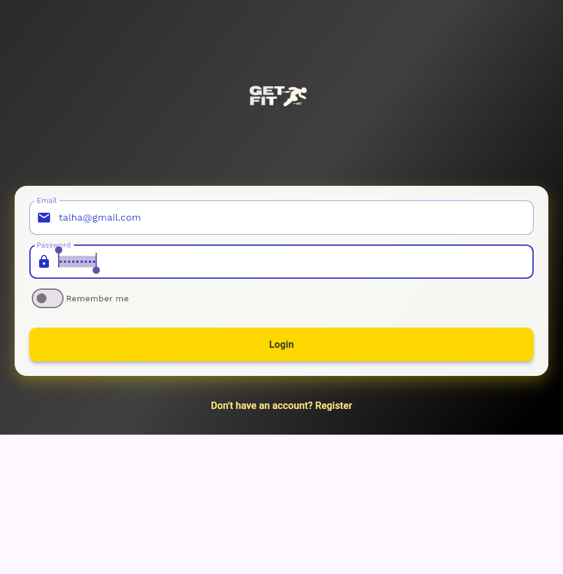
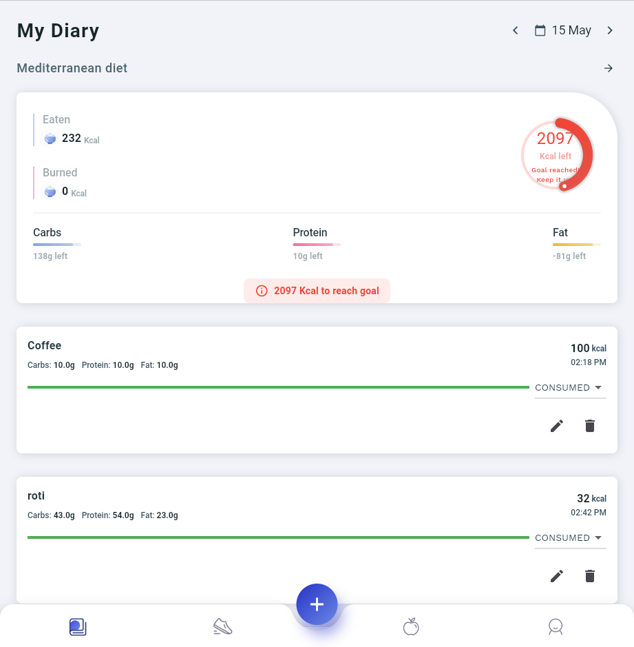
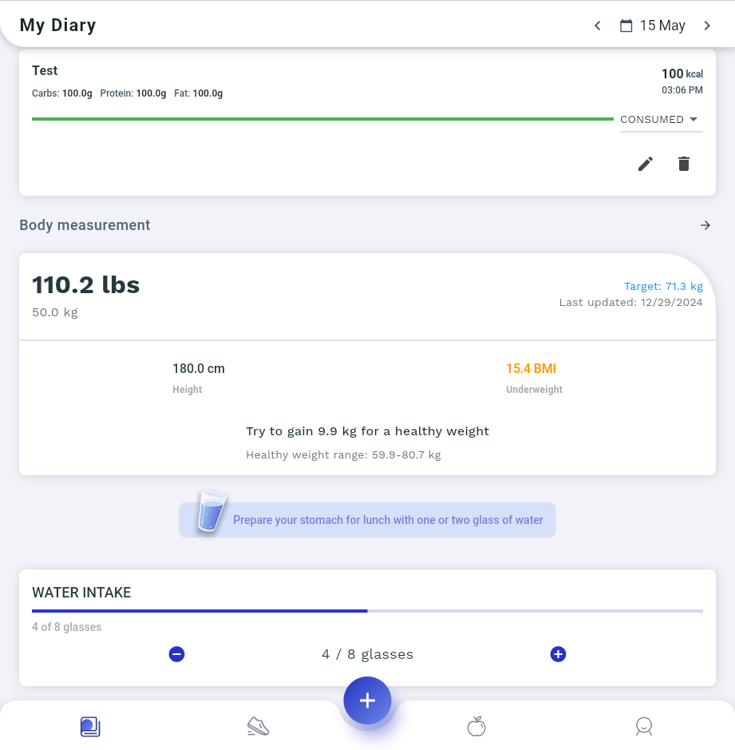

# Fitness App

A modern fitness tracking app built with Flutter featuring workout tracking, meal planning, and progress monitoring.

## Getting Started

### Prerequisites
- Flutter SDK (3.0 or higher)
- Android Studio or VS Code
- Git

### Installation
1. Clone the repository
```bash
git clone https://github.com/talha1230/Fitness_unimy.git
```

2. Install dependencies
```bash
flutter pub get
```

3. Run the app
```bash
flutter run
```

## Features

- 🏃‍♂️ Workout Tracking
- 📊 Progress Monitoring
- 🍎 Meal Planning
- 📈 Activity Statistics
- 💪 Exercise Library

## Screenshots

<p align="center">
  
  &nbsp;&nbsp;&nbsp;&nbsp;
  
  &nbsp;&nbsp;&nbsp;&nbsp;
  
</p>

## Project Structure

```
lib/
├── fitness_app/
│   ├── models/
│   ├── ui_view/
│   └── fitness_app_home_screen.dart
├── main.dart
└── app_theme.dart
```

## Development

### Code Style
Follow the official [Flutter style guide](https://flutter.dev/docs/development/style-guide)

### Running Tests
```bash
flutter test
```

### Building for Production
```bash
flutter build apk --release  # Android
flutter build ios --release  # iOS
```

### Running on Different Platforms

#### Web Browsers
```bash
# Run on Edge
flutter run -d edge

# Run on Chrome
flutter run -d chrome

# List all available devices
flutter devices
```

#### Enable Web Support
If web support is not enabled:
```bash
flutter config --enable-web
flutter devices # Verify web devices are listed
```

#### Build for Web
```bash
# Build for web deployment
flutter build web

# Build with specific renderer
flutter build web --web-renderer html
flutter build web --web-renderer canvaskit
```

The built web files will be in `build/web` directory.

### Debugging in Browsers
- Chrome DevTools: Press F12 or right-click -> Inspect
- Edge DevTools: Press F12 or right-click -> Inspect

## Database Configuration

### Appwrite Setup Guide

1. Create Appwrite Account
   - Go to [Appwrite Cloud](https://cloud.appwrite.io)
   - Sign up for a new account or login

2. Create New Project
   - Click "Create Project"
   - Name your project (e.g., "fitness_app")
   - Choose a project ID
   - Select "Add platform" and choose "Flutter"
   - Follow the setup instructions for your platform

3. Create Database
   - Go to Databases → Create Database
   - Name it (e.g., "fitness_db")
   - Copy the Database ID

4. Create Collections
   Create the following collections with these attributes:

#### User Profiles Collection
| Attribute | Type | Required | Description |
|-----------|------|----------|-------------|
| name | string | Yes | User's full name |
| email | string | Yes | User's email address |
| profile_image | string | No | URL to profile image |
| fitness_goals | string[] | No | Array of fitness goals |
| weight | number | Yes | Weight in kg |
| height | number | Yes | Height in cm |

#### Workouts Collection
| Attribute | Type | Required | Description |
|-----------|------|----------|-------------|
| user_id | string | Yes | Reference to user |
| name | string | Yes | Workout name |
| exercises | string[] | Yes | List of exercises |
| duration | number | Yes | Duration in minutes |
| date | datetime | Yes | Workout date |

#### Meals Collection
| Attribute | Type | Required | Description |
|-----------|------|----------|-------------|
| user_id | string | Yes | Reference to user |
| name | string | Yes | Meal name |
| calories | number | Yes | Total calories |
| protein | number | Yes | Protein in grams |
| carbs | number | Yes | Carbs in grams |
| fats | number | Yes | Fats in grams |
| date | datetime | Yes | Meal date |

### Environment Setup

1. Create `.env` file in project root:
```properties
APPWRITE_ENDPOINT=https://cloud.appwrite.io/v1
APPWRITE_PROJECT_ID=your_project_id        # From Project Settings
APPWRITE_DATABASE_ID=your_database_id      # From Database Overview
APPWRITE_USER_COLLECTION_ID=user_profiles  # From Collection Details
APPWRITE_WORKOUT_COLLECTION_ID=workouts    # From Collection Details
APPWRITE_MEALS_COLLECTION_ID=meals         # From Collection Details
```

2. Add `.env` to `.gitignore`:
```
# .gitignore
.env
```

3. Install dependencies in `pubspec.yaml`:
```yaml
dependencies:
  flutter_dotenv: ^5.0.2
  appwrite: ^9.0.0
```

4. Load environment variables in `main.dart`:
```dart
import 'package:flutter_dotenv/flutter_dotenv.dart';

void main() async {
  await dotenv.load();  // Load .env file
  AppwriteService.initialize();
  runApp(MyApp());
}
```

### Security Best Practices
- Never commit `.env` to version control
- Set up appropriate collection permissions in Appwrite Console
- Enable authentication for all collections
- Use API keys only in secure environments
- Monitor API usage in Appwrite Console

## License
This project is licensed under the MIT License. You may freely use and modify the code, including Appwrite integrations, provided you:
- Include the original license
- Do not hold the authors liable
- Maintain security best practices
- Keep API credentials private
```

## License
This project is licensed under the MIT License - see the LICENSE file for details
